  

## About Me

I am currently attending high school and also pursuing a technical course in Systems Development at SENAI and taking a technical course in Web Informatics at CentroWEG.

I'm a developer who is constantly growing, always looking to learn new tools, explore different areas of technology, and build projects that challenge me. I enjoy turning ideas into code and continuously improving my skills.

 

  

## GitHub Statistics

<table align="center" width="100%">
<tr>
<td align="center" width="50%">
  
</td>

<td align="center" width="50%">
  
</td>
</tr>
</table>

 

<table align="center" width="100%">
<tr>
<td align="center">
  
</td>
</tr>
</table>

 

  

