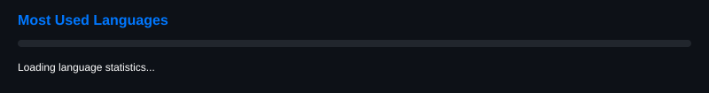

  

## About Me

I am currently attending high school and also pursuing a technical course in Systems Development at SENAI and taking a technical course in Web Informatics at CentroWEG.

I'm a developer who is constantly growing, always looking to learn new tools, explore different areas of technology, and build projects that challenge me. I enjoy turning ideas into code and continuously improving my skills.

 

## Technologies I Use

<h3 align="left">Front-end</h3>

<table align="left">
<tr>
<td align="center" width="75" height="65"></td>
<td align="center" width="75" height="65"></td>
<td align="center" width="75" height="65"></td>
<td align="center" width="75" height="65"></td>
</tr>
</table>

 

<h3 align="left">Back-end</h3>

<table align="left">
<tr>
<td align="center" width="75" height="65"></td>
<td align="center" width="75" height="65"></td>
</tr>
</table>

 

<h3 align="left">Databases</h3>

<table align="left">
<tr>
<td align="center" width="75" height="65"></td>
</tr>
</table>

 

<h3 align="left">Other Technologies</h3>

<table align="left">
<tr>
<td align="center" width="75" height="65"></td>
<td align="center" width="75" height="65"></td>
<td align="center" width="75" height="65"></td>
<td align="center" width="75" height="65"></td>
<td align="center" width="75" height="65"></td>
<td align="center" width="75" height="65"></td>
<td align="center" width="75" height="65"></td>
<td align="center" width="75" height="65"></td>
</tr>
</table>

 
 

## GitHub Statistics

<table align="center" width="100%">
<tr>
<td align="center" width="50%"></td>
<td align="center" width="50%"></td>
</tr>
</table>

 

<table align="center" width="100%">
<tr>
<td align="center"></td>
</tr>
</table>

 

## Get in Touch

Feel free to reach out! You can contact me through the platforms below.

<table align="center">
<tr>
<td align="center" width="75" height="65"></td>
<td align="center" width="75" height="65"></td>
<td align="center" width="75" height="65"></td>
</tr>
</table>

  

